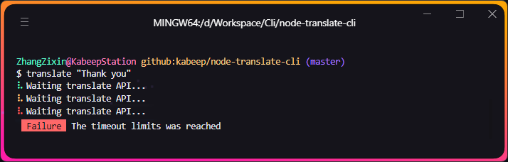
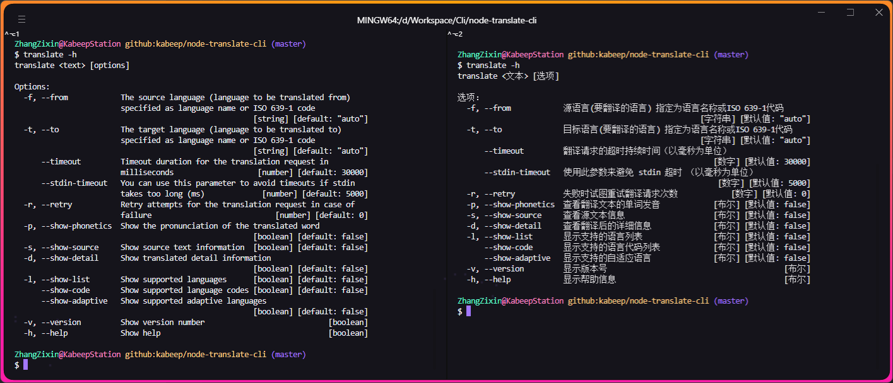

<div align="center">


A powerful, secure and feature-rich tool via Google Translation **in terminal**.

---

[](https://nodejs.org/docs/latest/api/)
[](LICENSE)
[](https://www.npmjs.com/package/@kabeep/node-translate-cli)
[](https://codecov.io/gh/kabeep/node-translate-cli)
[](https://app.codacy.com/gh/kabeep/node-translate-cli/dashboard?utm_source=gh&utm_medium=referral&utm_content=&utm_campaign=Badge_grade)
[](https://dl.circleci.com/status-badge/redirect/circleci/Qh23T2Zgw4Fy4V8uvKaymp/XWLHQrsMmQsM3jydfFa2AW/tree/master)

English | [简体中文](README.zh-CN.md)


</div>

## 📖 Introduction

> Using the [node-translate](https://github.com/kabeep/node-translate) API in the terminal.
>
> The API bypasses token restrictions.
> If it is used in large quantities or for business, please support the work of
> Google Translation, which provides a lot of free credits.

#### Besides simple text translation, it also provides:

- Adaptive translation language
- Automatic correction of the source text
- Getting source text from stdin
- Polysemous translation results
- Synonyms of the source text
- Example sentences of the source text
- Phonetic transcription of the source and translated text
- Stable output and error prompts
- Beautiful terminal styling
- Internationalized prompt for terminal

## ⚙️ Installation

```bash
npm install @kabeep/node-translate-cli --save
```

```bash
yarn add @kabeep/node-translate-cli
```

```bash
pnpm add @kabeep/node-translate-cli
```

## 🚀 Usage

```text
translate <text> [options]

options：
  -f, --from            The source language (language to be translated from)
                        specified as language name or ISO 639-1 code
                                                           [string] [default: "auto"]
  -t, --to              The target language (language to be translated to)
                        specified as language name or ISO 639-1 code
                                                           [string] [default: "auto"]
      --timeout         Timeout duration for the translation request in
                        milliseconds                       [number] [default: 30000]
      --stdin-timeout   You can use this parameter to avoid timeouts if stdin
                        takes too long (ms)                [number] [default: 5000]
  -r, --retry           Retry attempts for the translation request in case of
                        failure                            [number] [default: 0]
  -p, --show-phonetics  Show the pronunciation of the translated word
                                                           [boolean] [default: false]
  -s, --show-source     Show source text information       [boolean] [default: false]
  -d, --show-detail     Show translated detail information [boolean] [default: false]
  -l, --show-list       Show supported language list       [boolean] [default: false]
      --show-code       Show supported language code list  [boolean] [default: false]
      --show-adaptive   Show adaptive language             [boolean] [default: false]
  -v, --version         Show version                       [boolean]
  -h, --help            Show help info                     [boolean]
```

## 🪄 Examples

#### Using stdin

```shell
echo "test" | translate -f en -t zh
```

#### Using iso-639-1 and text parameters

```shell
translate "test" --from=en --to=zh
```

#### Using language name and capitalized correction

```shell
translate "test" --from="ENGLISH" --to="chinese"
```

#### Adaptive source language

```shell
translate "test" -t zh
```

#### Self-detection of native language

```shell
translate "test" -f en
```

#### Autocorrect source text

```shell
translate "Thunk you"
```

#### Translate words and show synonyms, polysemy explanations and examples

```shell
translate "test" -d
```

#### Translate a word, phrase or sentence and show the source text and phonetic symbols

```shell
translate "test" -s -p
```

#### Set API timeout

```shell
translate "test" --timeout=60000
```

#### Set the timeout for the standard input stream

```shell
npm view node-translate-cli description | translate --stdin-timeout=30000
```

#### Set the number of retries when an API request fails

```shell
translate "test" -r 2
```

#### Show supported languages

```shell
translate -l
```

#### Show supported language codes

```shell
translate --show-code
```

#### Show supported adaptive languages

```shell
translate --show-adaptive
```

#### Show help information

```shell
translate -h
```

#### Show the version of current

```shell
translate -v
```

## 🧙🏽‍♂️ Advanced

#### Using another npm package

```shell
npm install -g clipboard-cli

# Use the clipboard-cli to copy translation results to the clipboard
translate 'Translate this sentence to your clipboard' | clipboard
```

#### Using the static accessor `$()` method

```shell
git commit -m "$(translate 'feat: your commit content' -t zh)"
```


#### Using the pipe `|` symbol

```shell
npm info npm description | translate -t zh
```


#### Using the redirection `>` symbol

```shell
translate "这是一段测试文本。" -t en > usage.txt
```


## 🔧 Autocorrect

> `Default` white
>
> `Detect Language` yellow
>
> `Detect Spelling` red


## 🐢 Network anomaly

> When the network is abnormal, the terminal will change as shown in the figure below
> (they actually come from the same line).



## ⌨️ Automatic line wrapping

> When a single line of content is too long, the terminal will automatically wrap the line after the title.


## 🌐 i18n

Quickly contribute your language via ease-to-use [node-translate-i18n](https://github.com/kabeep/node-translate-i18n)
in [locale](https://github.com/kabeep/node-translate-cli/tree/master/src/locale/index.ts) file are welcome,
or notify me via [Issues](https://github.com/kabeep/node-translate-cli/issues) for handling.



## 🔗 Related

- [node-translate](https://github.com/kabeep/node-translate) - 🦜 A powerful, secure and feature-rich api via Google
  Translation.
- [node-translate-i18n](https://github.com/kabeep/node-translate-i18n) - 🌏 A command-line interface tool for translating
  localization files to other languages.
- [google-translate-cli](https://github.com/jesusalber1/google-translate-cli) - Google Translate via CLI.

## 🤝 Contribution

Contributions via Pull Requests or [Issues](https://github.com/kabeep/node-translate-cli/issues) are welcome.

## 📄 License

This project is licensed under the MIT License. See the [LICENSE](LICENSE) file for details.
