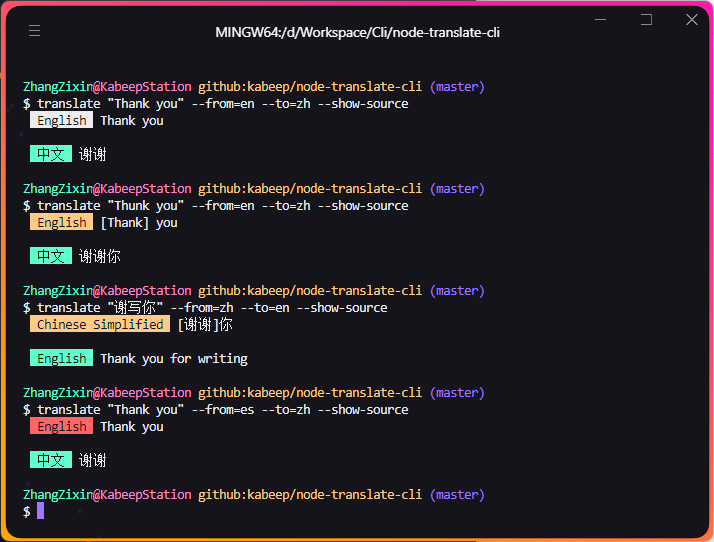

<div align="center">


一个强大、安全且功能丰富的**终端**工具，通过 Google 翻译。

---

[](https://nodejs.org/docs/latest/api/)
[](LICENSE)
[](https://www.npmjs.com/package/@kabeep/node-translate-cli)
[](https://codecov.io/gh/kabeep/node-translate-cli)
[](https://app.codacy.com/gh/kabeep/node-translate-cli/dashboard?utm_source=gh&utm_medium=referral&utm_content=&utm_campaign=Badge_grade)
[](https://dl.circleci.com/status-badge/redirect/circleci/Qh23T2Zgw4Fy4V8uvKaymp/XWLHQrsMmQsM3jydfFa2AW/tree/master)

[English](README.md) | 简体中文


</div>

## 📖 简介

> 在终端中使用 [node-translate](https://github.com/kabeep/node-translate) API。
>
> **Api 接口没有 token 限制，如果大量使用或用于商业，请支持 Google Translation 的工作，它提供了很多的免费额度。**

#### 除了简单的翻译文本，它还能够：

- 自适应翻译语言
- 自动修正源文本
- 从标准输入流中获取源文本
- 多义的翻译结果
- 源文本同义词
- 源文本例句
- 源文本和翻译文本的音标
- 稳定地输出和异常提示
- 漂亮的终端样式
- 国际化的终端提示

## ⚙️ 安装

```bash
npm install @kabeep/node-translate-cli --save
```

```bash
yarn add @kabeep/node-translate-cli
```

```bash
pnpm add @kabeep/node-translate-cli
```

## 🚀 使用

```text
translate <text> [options]

选项：
  -f, --from            源语言(要翻译的语言) 指定为语言名称或ISO 639-1代码
                                                           [字符串] [默认值: "auto"]
  -t, --to              目标语言(要翻译的语言) 指定为语言名称或ISO 639-1代码
                                                           [字符串] [默认值: "auto"]
      --timeout         翻译请求的超时持续时间（以毫秒为单位）    [数字] [默认值: 30000]
      --stdin-timeout   使用此参数来避免 stdin 超时 （以毫秒为单位）
                                                           [数字] [默认值: 5000]
  -r, --retry           失败时试图重试翻译请求次数              [数字] [默认值: 0]
  -p, --show-phonetics  查看翻译文本的单词发音                 [布尔] [默认值: false]
  -s, --show-source     查看源文本信息                        [布尔] [默认值: false]
  -d, --show-detail     查看翻译后的详细信息                   [布尔] [默认值: false]
  -l, --show-list       显示支持的语言列表                    [布尔] [默认值: false]
      --show-code       显示支持的语言代码列表                 [布尔] [默认值: false]
      --show-adaptive   显示支持的自适应语言                   [布尔] [默认值: false]
  -v, --version         显示版本号                           [布尔]
  -h, --help            显示帮助信息                         [布尔]
```

<div align="center">


i18n

</div>

## 🪄 例子

#### 使用标准输入流

```shell
echo "test" | translate -f en -t zh
```

#### 使用 iso-639-1 和文本参数

```shell
translate "test" --from=en --to=zh
```

#### 使用语言名称和大小写修正

```shell
translate "test" --from="ENGLISH" --to="chinese"
```

#### 自适应原文语言

```shell
translate "test" -t zh
```

#### 自检测本机语言

```shell
translate "test" -f en
```

#### 自动修正

```shell
translate "Thunk you"
```

#### 翻译单词，并展示同近义词、多义解释和例句

```shell
translate "test" -d
```

#### 翻译单词、词组或句子，并展示原文和音标

```shell
translate "test" -s -p
```

#### 设置 API 超时时间

```shell
translate "test" --timeout=60000
```

#### 设置标准输入流的超时时间

```shell
npm view node-translate-cli description | translate --stdin-timeout=30000
```

#### 设置 API 请求失败时的重试次数

```shell
translate "test" -r 2
```

#### 查看支持的语言列表

```shell
translate -l
```

#### 查看支持的语言代码列表

```shell
translate --show-code
```

#### 查看支持的自适应语言列表

```shell
translate --show-adaptive
```

#### 查看帮助信息

```shell
translate -h
```

#### 查看当前版本

```shell
translate -v
```

## 🔧 自动修正

> `常规` 白色
>
> `语言错误` 黄色
>
> `拼写错误` 红色

<div align="center">



</div>

## 🐢 网络异常

> 网络异常时，终端会发生下图中的变化（它们实际来自同一行内容）。

<div align="center">


</div>

## ⌨️ 自动换行

> 当单行内容过长时，终端会在标题后自动换行。

## 🔗 关联库

- [node-translate](https://github.com/kabeep/node-translate) - 🦜 一个强大、安全且功能丰富的 API，通过 Google 翻译。
- [google-translate-cli](https://github.com/jesusalber1/google-translate-cli) - 通过 CLI 进行谷歌翻译。

## 🤝 贡献

欢迎通过 Pull Requests 或 [Issues](https://github.com/kabeep/node-translate-cli/issues) 来贡献你的想法和代码。

## 📄 许可

本项目采用 MIT 许可证。详情请见 [LICENSE](LICENSE) 文件。